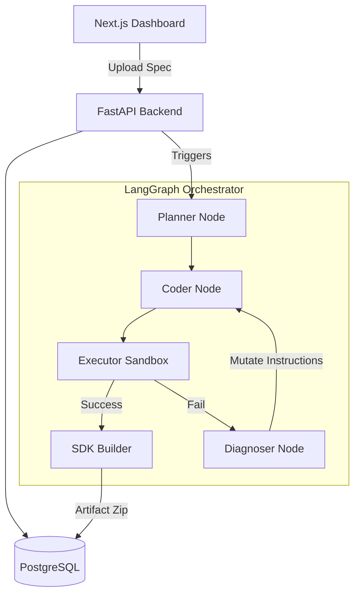

# APIForge AI

**APIForge AI** is an autonomous Agentic API Integration Platform. It utilizes a LangGraph-powered orchestrator to automatically parse OpenAPI specifications, map dependencies, write execution scripts, test endpoints, and gracefully self-heal from failures. Finally, it dynamically compiles and exports a production-ready Python SDK for your API.

## Core Capabilities

- **Autonomous Integration**: Upload an OpenAPI or Swagger spec, and the agent takes over.
- **Agentic Self-Healing**: Uses deterministic evaluation (Planner -> Coder -> Executor -> Diagnoser loop). If an endpoint test fails (e.g., missing authentication), the Diagnoser parses the `stderr/stdout` logs, infers the fix, and mutates the code until it succeeds.
- **Production-Ready SDK Generation**: Once validated, the agent bundles valid, working Python models and HTTP client code into a downloadable `.zip` artifact.
- **Execution Timeline**: A Next.js dashboard visually streams the agent's thought process, transitions, and execution results in real-time.

## Architecture

## How Self-Healing Works (Case Study)

When testing an undocumented secured endpoint:

1. **Attempt 1 (Coder):** Generates standard GET request without headers.
2. **Execution (Executor):** Runs script in Python Sandbox -> Fails with HTTP 401 Unauthorized.
3. **Diagnosis (Diagnoser):** Parses the `stdout` `{"detail":"Missing Authorization header..."}`. Infers that the endpoint requires a Bearer token.
4. **Attempt 2 (Coder):** Injects `headers={'Authorization': 'Bearer VALID_TOKEN'}`.
5. **Execution:** Success (200 OK).

## Local Setup

### Prerequisites
- Python 3.12+
- Node.js 18+
- PostgreSQL (Native or via Docker)
- Poetry

### Backend
1. `cd backend`
2. `poetry install`
3. Export your LLM provider key (e.g., `export GROQ_API_KEY="your-key"`)
4. Run migrations: `poetry run alembic upgrade head`
5. Start server: `poetry run uvicorn app.main:app --reload --port 8000`

### Mock API (For Testing Self-Healing)
1. `cd backend`
2. `poetry run python mock_api.py` (Runs on port 8001)

### Frontend
1. `cd frontend`
2. `npm install`
3. `npm run dev` (Runs on port 3000)

## Demo Specs
In the `specs/` directory, you can find `failure_recovery_api.yaml` designed explicitly to demonstrate the self-healing capability against the local mock server.
