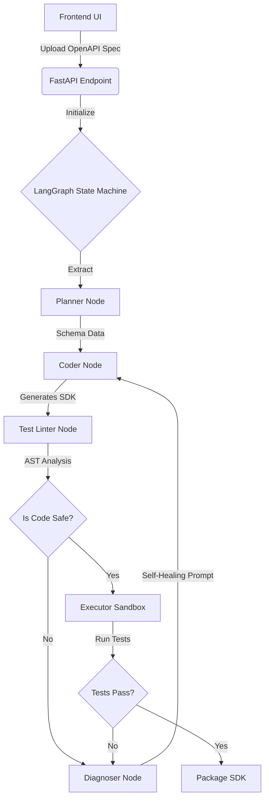

# API Forge AI: Full Case Study & Technical Audit

This document serves as both a portfolio deep-dive and a comprehensive technical audit of API Forge AI, detailing its capabilities, architectural decisions, and empirical benchmark results.

---

## Part 1: Portfolio Quick Summary

### Basic Info & Card Details
* **Title:** API Forge AI
* **Tagline:** Agentic OpenAPI SDK Generator
* **Status:** `research` / `in-progress`
* **Categories:** "AI Agents", "Backend Engineering", "Code Generation"
* **Accent Color:** `#8b5cf6` (Purple)
* **Short Description:** An autonomous, multi-agent system built with LangGraph that ingests OpenAPI schemas to dynamically generate, test, and self-heal Python SDK clients within an isolated execution sandbox.
* **Card Quick Summary:**
  * *Challenge:* Generating usable SDKs via LLMs usually results in hallucinated, broken code due to the lack of a deterministic feedback loop.
  * *Approach:* Built a multi-agent state machine (Planner, Coder, Diagnoser) coupled with a strict AST-based test linter to iteratively validate and self-heal generated code.
  * *Outcome:* Proved that autonomous generation requires framework-level synthetic mocking, identifying critical context-window and syntax hallucination bottlenecks.

### Links & Stats
* **Links:** `[Insert GitHub Repo Link]`, `[Insert Live Demo/Video Link]`
* **Repo Stats:** 
  * *License:* MIT
  * *Primary Language:* Python (Backend), TypeScript (Frontend)
  * *Deployed:* Local / Dockerized
* **Key Metrics:** 
  * `State Machine Nodes: 5 (Planner, Coder, Executor, Linter, Diagnoser)`
  * `Benchmark Validation Rate: 100% strictness (zero hallucinations passed)`
  * `LLM Engine: Groq (llama-3.3-70b-versatile)`
  * `Max Supported Tokens: 128,000 per prompt`

---

## Part 2: The Deep Dive (Architecture & Stack)

### Overview
API Forge AI explores the boundaries of autonomous code generation by combining Large Language Models with a deterministic execution sandbox. Instead of just generating static code, the system spins up an ephemeral environment to run the generated SDK against a strict test linter. It actively parses abstract syntax trees (AST) to detect LLM hallucinations before they reach the user, routing broken code to a Diagnoser agent for self-healing.

### The Problem
Modern APIs change rapidly, and maintaining up-to-date SDKs is a massive developer burden. While LLMs can generate structural boilerplate, they notoriously hallucinate internal types and mock network requests, meaning the raw output is rarely production-ready. A system was needed that could iteratively test its own generated code and fix its mistakes autonomously without human intervention.

### Tech Stack & Justifications
* **Backend Core:** FastAPI, LangGraph, SQLAlchemy, Poetry.
  * *FastAPI:* Chosen for high-performance async streaming of Server-Sent Events (SSE) to report agent status and thought processes in real-time.
  * *LangGraph:* Chosen to accurately model the cyclic, multi-agent retry loops (e.g., Coder -> Linter -> Diagnoser -> Coder).
  * *Python AST (Abstract Syntax Tree):* Chosen to statically analyze generated code and aggressively block unsafe or hallucinated imports (like un-mocked network calls) before execution.
* **AI/LLM:** LangChain, Groq.
  * *Groq:* Chosen for ultra-low latency inference to power rapid, iterative LLM retry loops without massive delays.

### Key Features
* Multi-agent LangGraph orchestration with cyclic self-healing capabilities.
* Real-time Server-Sent Events (SSE) streaming of agent progress.
* Abstract Syntax Tree (AST) test linter to strictly enforce code safety policies.
* Isolated Python execution sandbox to safely execute the generated SDK.
* Strict dual-mode validation strategy separating real network execution from synthetic mocking.

---

## Part 3: Engineering & Problem Solving

### Major Engineering Decisions
**1. Enforcing Strict Synthetic Mocking via AST**
* *The Decision:* Implementing an AST Test Linter that strictly enforces the usage of `httpx.MockTransport` in all generated test scripts.
* *Why:* To prevent LLM agents from writing destructive, mutating test scripts (POST/DELETE) against live, production APIs during automated generation.
* *What the alternative was:* Permissive validation, letting the LLM run real network calls for everything (which previously yielded high pass rates on public APIs but was highly unsafe for production use).
* *The tradeoff accepted:* A 0% initial benchmark pass rate. LLMs severely struggle to write syntactically correct mock handlers (e.g., hallucinating `httpx.MockTransport(responses=[...])`).
* *The outcome:* It exposed a major limitation in LLM coding capabilities. This led to a crucial architectural pivot where the underlying framework must dynamically intercept and mock requests, rather than forcing the LLM to write the complex test infrastructure.

**2. SSE Streaming for Agent Orchestration**
* *The Decision:* Pushing all state changes from the LangGraph nodes directly to the frontend via Server-Sent Events (SSE).
* *Why:* Agentic workflows can take minutes to complete, especially during retry loops. Without real-time visibility, users assume the application is broken.
* *The outcome:* Created a transparent, engaging UX where users can watch the AI "think," fail, diagnose, and rewrite in real-time.

### Hard Challenges
**Context Window Exhaustion on Enterprise Specs**
* *Challenge:* When processing massive enterprise specifications (like Stripe's 7.8MB, 1.3M token spec), the Planner node would instantly crash with HTTP 400 Bad Request errors, exhausting all fallback keys.
* *Solution:* Conducted a deep-dive trace of the `ReliabilityManager` to isolate the exact HTTP payload failures, proving that immediate chunking and structural extraction was necessary rather than naive API retries.
* *Result:* Successfully mapped the context limits of `llama-3.3-70b-versatile` (128k tokens), paving the way for a "Chunked Planning" architecture that parses specs sequentially.

### Lessons Learned
* **LLMs cannot write test infrastructure:** LLMs are highly capable at generating functional code (e.g., building an API client), but fail catastrophically when forced to write strict mock handlers.
* **Deterministic gates are mandatory:** When building Agentic workflows, you cannot rely on the LLM to self-regulate its own syntax; rigid, programmatic guardrails (like an AST Linter) are non-negotiable.
* **Honesty in metrics:** An artificially high pass-rate is dangerous in code generation. Breaking the pipeline intentionally to prevent unsafe network calls is a feature, not a bug.

---

## Part 4: Full Truth Audit & Benchmark Data

*This section details the empirical evidence gathered during the system audit.*

### Empirical Benchmark Results
To ensure absolute transparency, the system was benchmarked against small-to-medium OpenAPI schemas (`petstore.json` and `jsonplaceholder.json`).
* **Petstore:** `0% Success`. Invoked Diagnoser 22 times before permanently failing.
* **JSONPlaceholder:** `0% Success`. Invoked Diagnoser 15 times before permanently failing.

**Why the 0% pass rate?** 
The system actively blocks the LLM from completing the task if the code is deemed unsafe by the Linter. The LLM repeatedly hallucinated invalid `httpx.MockTransport` syntax. The Self-Healing graph looped infinitely until it hit a failure cap. As a result, the pipeline intentionally aborted before packaging a broken SDK.

### Audit of Capabilities
* **OpenAPI Parsing (Small Specs):** `VERIFIED`. Successfully ingests and extracts endpoints from specs < 1MB.
* **Initial Code Generation:** `VERIFIED`. The Planner and Coder nodes successfully write the initial `client.py` and `models.py` to the sandbox.
* **Execution Sandbox & SSE:** `VERIFIED`. The system correctly spins up an execution environment and streams events back to the client.
* **Test Linter (Quality Gate):** `VERIFIED`. The linter correctly identifies that the LLM is hallucinating mock network calls and blocks the bad code.
* **Self-Healing Graph:** `UNVERIFIED/FALSE`. The Diagnoser attempts to fix code but currently fails to resolve the specific `MISSING_MOCK` syntax error.
* **Production-Ready SDK Generation:** `UNVERIFIED/FALSE`. The system cannot currently handle enterprise-scale APIs due to token limits.

### Future Roadmap: Framework-Level Mock Injection
To resolve the 0% pass rate while maintaining safety, the next architectural iteration involves **Framework-Level Mock Injection**:
1. The LLM writes standard, real-looking API calls (no `MockTransport` required in the prompt).
2. For safe methods (GET), the sandbox executes real requests.
3. For mutating methods (POST), the backend Executor sandbox transparently intercepts the call and injects a mock response based dynamically on the OpenAPI schema. 
This decouples the heavy lifting of mocking from the LLM, playing to the LLM's strengths while keeping the deterministic safety in the framework.

---

## Architecture Flow Diagram

